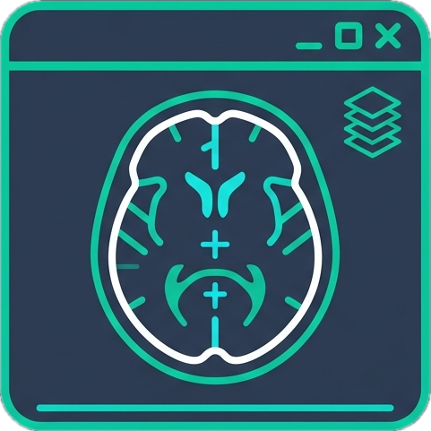
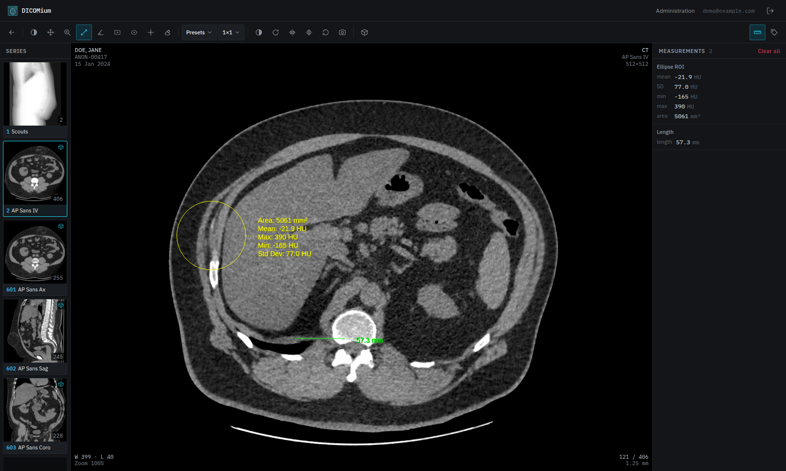
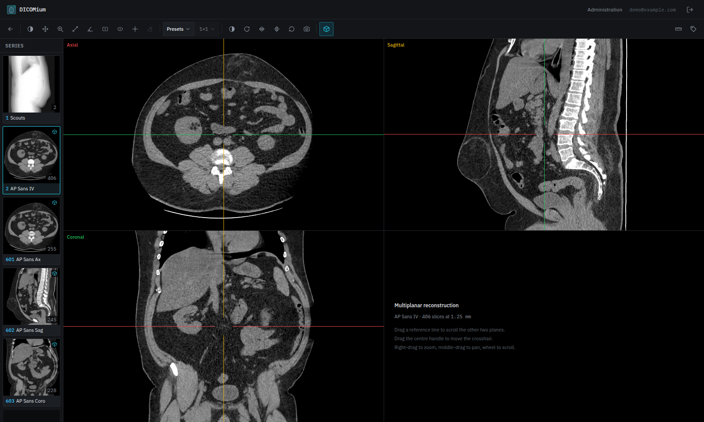
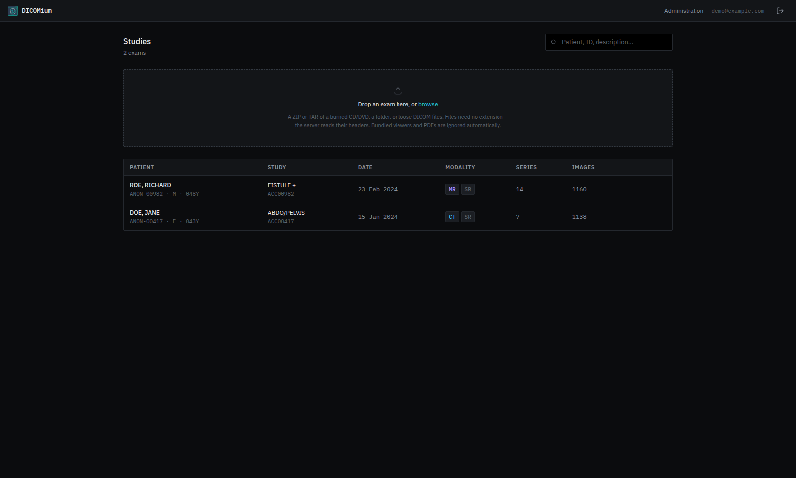
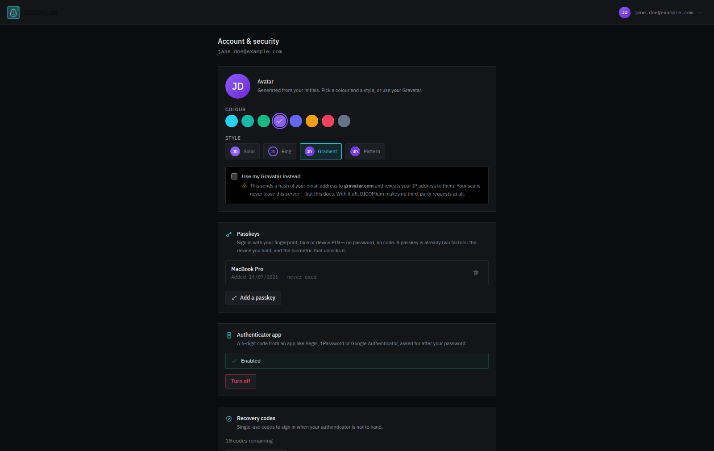

<p align="center">
  
</p>

<h1 align="center">DICOMium</h1>

<p align="center">
  <strong>A private, self-hosted medical imaging viewer for the web.</strong>
</p>

<p align="center">
  Upload the CD or DVD handed to you by a radiology department and explore it directly in
  your browser — no desktop software, cloud account, or data leaving your machine.
</p>

<p align="center">
  
  <a href="https://hub.docker.com/r/acaranta/dicomium">
    
  </a>
  
  <a href="LICENSE">
    
  </a>
</p>

<p align="center">
  <a href="#quick-start">Quick start</a> ·
  <a href="#what-it-does">Features</a> ·
  <a href="#roadmap">Roadmap</a> ·
  <a href="#architecture">Architecture</a> ·
  <a href="LICENSE">AGPL-3.0</a>
</p>

---

Runs as a single Docker container. Files are stored on a plain mounted volume, in a
directory tree you can read with `ls`.

## Screenshots

<p align="center">
  
  <br />
  <em>The viewer. On CT, ROI statistics read in real Hounsfield units.</em>
</p>

<p align="center">
  
  <br />
  <em>MPR — one volume, three linked planes, crosshairs in the radiology convention.</em>
</p>

<table>
  <tr>
    <td width="50%" valign="top">
      
      <br />
      <em>Your library. Drop a DVD on it and it sorts itself out.</em>
    </td>
    <td width="50%" valign="top">
      
      <br />
      <em>Passkeys, an authenticator app, and recovery codes.</em>
    </td>
  </tr>
</table>

> The exams pictured are real scans whose identifying tags were rewritten before they were
> loaded. **The patients shown are fictional.**

## What it does

**Viewer** — a dark, Weasis-style workstation.

- Stack scrolling, pan, zoom, window/level, with CT presets (lung, bone, brain, abdomen…)
- Measurements: length, angle, rectangle/ellipse ROI (mean, SD, min, max, area), probe.
  On CT these read in **Hounsfield units** — an ROI over air reads about −1000 HU.
- Viewport grids from 1×1 to 3×3; drag any series into any cell
- **MPR**: reconstruct a volume into linked axial / sagittal / coronal planes with crosshairs
- Multi-frame series (ultrasound and angiography loops) load frame-by-frame and scroll
- Searchable DICOM tag inspector, and PNG export with the measurements drawn on

**Ingest** — built for the mess that real burned discs actually contain.

- Accepts a ZIP or TAR of a disc, a dropped folder, or loose files
- Detects DICOM by **content, not extension** (files on a real DVD are named `A0001`,
  `B0001`… with no extension at all)
- Uses `DICOMDIR` when present, but always walks the whole tree too — burned-CD
  DICOMDIRs are frequently stale or incomplete
- Silently ignores the bundled viewers, DLLs, autorun stubs and PDFs that ship on every
  disc, instead of reporting 40 "errors"
- Re-uploading the same disc is a no-op (deduplicated on SOP Instance UID)
- Runs in the background with a live progress bar and a per-file error report

**Accounts** — self-registration; the first account created becomes the administrator.
Each user sees only their own exams, and every API path is scoped to them.

**Sign-in** — password, plus two optional factors you enable per account from `/account`:

- **Passkeys.** Fingerprint, face or device PIN — and that's the whole sign-in. No email,
  no password, no code. A passkey is *already* two factors (the device you hold, and the
  biometric that unlocks it), so it deliberately does not then ask for a TOTP code as well.
  Each one gets a name — suggested from your device ("iPhone", "Windows PC"…) when you add
  it, yours to edit, and renameable later by clicking it on `/account`.
- **Authenticator app (TOTP).** A 6-digit code after your password, with **10 one-time
  recovery codes** for when your phone isn't to hand.

> Browsers only permit passkeys in a secure context: **HTTPS, or `localhost`**. They will
> not work over plain HTTP on a LAN address — the UI says so rather than failing silently.
> Password and TOTP work everywhere.

**Profile** — the header carries a user menu now: your avatar, email, role, and quick links
to Account & security and, for admins, Administration. Avatars are initials on a coloured
circle — 8 colours × 4 styles, picked on `/account` — and an untouched account still gets a
stable one, derived from a hash of your email, so nothing looks unconfigured. A Gravatar
opt-in sits next to it, **off by default**: turning it on sends a hash of your email to
gravatar.com and reveals your IP to them. It's the one exception to "no data leaving your
machine" at the top of this page — everything else genuinely makes zero third-party requests.

## Roadmap

Nothing below is promised on a date. It is an honest list of what is missing, roughly in the
order it is likely to be worth doing. Contributions and opinions on the ordering are welcome.

### Next up

Small, visible gaps you notice within a few minutes of using it.

- **Translations.** Every string is currently hardcoded English. French first, since that is
  what the discs around here are printed in.
- **Cine playback.** Multi-frame loops already load and scroll; they just have no play button
  yet.
- **Touch and a responsive layout.** Today it assumes a mouse and a wide screen. Tablets are
  the obvious place to read a scan on the sofa.
- **Window presets beyond CT.** The presets are Hounsfield windows, which only mean anything
  on CT — so MR and ultrasound get a greyed-out button and nothing else.
- **Pagination in the study list.** The API already supports it; the interface does not, so a
  large library quietly stops at 100 studies.

### Getting your data back out

Right now DICOMium is a one-way door: exams go in and can be read, but they cannot come back
out. For something whose whole promise is *your data stays yours*, that is the wrong shape.

- **Export a study** — download it back as a plain zip of DICOM files.
- **De-identified export**, for handing a scan to a doctor, a second opinion, or a researcher
  without handing over the patient with it.
- **STOW-RS**, so other tools can push studies in over the standard rather than through the
  browser. (The DICOMweb API is read-only today: query and retrieve, no store.)
- **DIMSE** — receive studies directly from a modality or another archive.

### More of the DICOM standard

Several object types are already ingested, indexed and listed — they simply have no renderer,
so they sit greyed out in the series panel.

- **Structured reports and dose reports**, **encapsulated PDF**, and **ECG waveforms**. Your
  disc almost certainly contains at least one of these.
- **Segmentation overlays.**
- **MIP and 3D volume rendering.** MPR is done; these are the natural next step from it.

### Persistence, sharing, deployment

- **Measurements that survive a reload.** They currently live only in the browser: close the
  tab and they are gone. They should be saved against the study.
- **Sharing** — with another user of the same instance, or via an expiring read-only link.
  Studies are strictly private today, with no way to share at all.
- **OIDC / forward-auth**, so DICOMium can sit behind an SSO you already run.
- **A Prometheus `/metrics` endpoint**, for anyone who monitors their own boxes.

### Non-goals

Deliberately out of scope, so nobody waits for them:

- **It is not a certified diagnostic device**, and will not seek to become one. Read your own
  scans with it; do not make clinical decisions on it.
- **It is not a full PACS.** No worklist, no scheduling, no reporting workflow.
- **It is not multi-tenant SaaS.** It is built to be run by one person or one household, on
  their own machine.

## Quick start

The image is published on Docker Hub as
[`acaranta/dicomium`](https://hub.docker.com/r/acaranta/dicomium), built for **amd64 and
arm64** — so it runs on a normal server, an Apple Silicon Mac, or a Raspberry Pi.

```bash
curl -O https://raw.githubusercontent.com/acaranta/DICOMium/main/docker-compose.yml
docker compose up -d
```

Open <http://localhost:8080>, create an account (**the first one becomes the administrator**),
and drag an exam onto the drop zone.

Or without compose at all:

```bash
docker run -d --name dicomium -p 8080:8080 \
  -v ./data:/data \
  -v ./dicomfiles:/dicomfiles \
  acaranta/dicomium:latest
```

Two volumes, and that is the whole story:

| | |
|---|---|
| `/dicomfiles` | your DICOM files, in a plain browsable tree. Point this at a real disk — one exam DVD is ~600 MB. |
| `/data` | the SQLite index, thumbnails, and the session secret. Rebuildable from `/dicomfiles`; the images are the source of truth. |

All configuration lives in the `environment:` block of `docker-compose.yml` — there is no
separate `.env` file, so there is exactly one place to look.

To update:

```bash
docker compose pull && docker compose up -d
```

### Building it yourself

If you would rather build from source than trust a prebuilt image — entirely reasonable for
something you are pointing at your medical records:

```bash
git clone https://github.com/acaranta/DICOMium.git && cd DICOMium
docker compose -f docker-compose.yml -f docker-compose.build.yml up --build
```

That reuses the same ports, volumes and environment from `docker-compose.yml`, and simply
builds the image locally instead of pulling it.

## Storage layout

DICOM files land on the `/dicomfiles` volume in a human-browsable tree:

```
/dicomfiles/<user>/<Patient>__<PatientID>/<StudyDate>_<Description>_<hash>/
    <SeriesNo>_<Description>_<hash>/<SOPInstanceUID>.dcm
```

for example:

```
/dicomfiles/jane/DOE_JANE__ANON-00417/20240115_ABDO_PELVIS_f9d6120c/
    002_AP_Sans_IV_ff4531df/1.2.840.113619.2.5.166636469.65900.1615815612.746.dcm
```

Every path component is sanitized to ASCII — DICOM descriptions contain slashes
(`ABDO/PELVIS`), accents and trailing spaces, none of which are safe as directory names.
The trailing hash makes two same-day studies with the same description distinct.

The SQLite index, thumbnails and session secret live on the separate `/data` volume. The
index is a cache: the DICOM files themselves are the source of truth.

## Configuration

Set these in the `environment:` block of `docker-compose.yml`. Every one has a working
default.

| Variable | Default | |
|---|---|---|
| `REGISTRATION_ENABLED` | `true` | Set `false` to close signups once your users exist |
| `COOKIE_SECURE` | `false` | Set `true` when serving over HTTPS |
| `SESSION_TTL_HOURS` | `168` | How long a sign-in lasts |
| `MAX_UPLOAD_MB` | `8192` | A burned DVD is typically 300–700 MB |
| `MAX_EXTRACT_MB` | `20480` | Zip-bomb guard |
| `DICOMWEB_TRANSCODE` | `auto` | `auto` streams compressed frames straight to the browser |
| `ADMIN_EMAIL` / `ADMIN_PASSWORD` | — | Optional: pre-create an admin instead of self-registering |
| `TOTP_ISSUER` | `DICOMium` | The label your authenticator app shows |
| `WEBAUTHN_RP_ID` / `WEBAUTHN_ORIGIN` | — | Optional: pin the passkey domain. Derived from the request otherwise |

### Locked out?

Recovery codes are the normal way back in. If a sole administrator loses their
authenticator *and* their recovery codes, clear their factors from inside the container:

```bash
docker compose exec dicomium python -m app.cli list-users
docker compose exec dicomium python -m app.cli reset-mfa you@example.com
```

They can then sign in with their password alone, and re-enrol.

## Architecture

One container, two processes under supervisor: nginx serves the SPA and reverse-proxies
uvicorn. Because they share an origin, the `HttpOnly` session cookie rides along on the
image requests with no CORS and no token plumbing.

```
browser ──┬─ /            → nginx → static SPA (React, Cornerstone3D)
          ├─ /api/*       → uvicorn (auth, upload, library)
          └─ /dicomweb/*  → uvicorn (QIDO-RS, WADO-RS)  ← the viewer loads pixels here
                                │
                  SQLite index (/data)   DICOM files (/dicomfiles)
```

The image API is a **minimal DICOMweb subset** (QIDO-RS + WADO-RS), which is what
Cornerstone3D speaks natively — so it streams frames per-slice rather than downloading
whole files, and you could point another DICOMweb client at the same server.

Compressed frames (JPEG, JPEG-LS, JPEG 2000, HTJ2K, RLE) are passed through to the
browser's wasm decoders untouched, costing the server no CPU. Only syntaxes the browser
cannot decode are decoded server-side.

**Stack**: FastAPI · pydicom · SQLAlchemy 2.0 (async) · SQLite · uv — React 18 · Vite ·
TypeScript · Tailwind · Cornerstone3D 5.

## Development

Backend and frontend run separately, with Vite proxying the API so the two stay
same-origin (exactly as nginx does in production):

```bash
# terminal 1
cd backend
DATA_DIR=../data DICOM_ROOT=../dicomfiles uv run uvicorn app.main:app --reload --port 8000

# terminal 2
cd frontend
npm install
npm run dev          # http://localhost:5173
```

If port 8000 is taken, run the backend elsewhere and point the proxy at it:
`BACKEND_URL=http://127.0.0.1:8199 npm run dev`.

```bash
cd backend && uv run pytest      # tests
cd frontend && npm run typecheck
```

## A note on the tests

The test suite encodes what real discs actually do, because that is where the bodies are
buried:

- `test_slug.py` — `ABDO/PELVIS - ` must become `ABDO_PELVIS`, not a nested directory
- `test_geometry.py` — a reformat series with a few embedded off-plane reference images
  is still reconstructable; MPR just excludes them
- `test_multipart.py` — golden bytes for the WADO-RS frame response. Cornerstone's
  multipart parser is a hand-rolled byte scanner, not a MIME parser: no preamble, a real
  `Content-Type` header line per part, CRLF before the closing boundary. "Tidying" any of
  those silently feeds the browser garbage pixels.
- `test_mfa_login.py` — while a user owes a second factor they must hold **no session at
  all**, so the tests try to reach a protected route from that half-authenticated state and
  assert 401. A "pending" flag on the real session would fail open the first time a route
  forgot to check it; a separate short-lived cookie cannot.
- `test_totp.py` — a code cannot be replayed inside its own 30-second window. Verifying a
  code is the easy half; recording which step it consumed is the half that gets skipped,
  and skipping it turns a second factor back into a single one.

## Not a medical device

This is a personal tool for reading your own exams. It is not certified for diagnostic
use, and nothing here should be relied on for clinical decisions.

## Who actually wrote this

Most of the code here was written by an AI, closely supervised by a bearded nerd who read
the diffs, pushed back on plenty of them, and refused to believe any of it worked until it
had been run against real burned exam DVDs — the messy kind, with no file extensions and a
Windows viewer bundled on the disc.

That bearded nerd is a systems engineer. **He is not a doctor**, not a radiologist, and not
anything within shouting distance of either. DICOMium exists because opening the DVD a
hospital hands you should not require installing someone's desktop software — *not* because
anyone involved is qualified to tell you what is in the pictures.

So: the software will happily show you your scan and measure it in real Hounsfield units.
Interpreting it is a job for someone who went to medical school. Please see
[Not a medical device](#not-a-medical-device), and take it literally.

## Licence

Copyright © 2026 Arthur Caranta.

**GNU Affero General Public License v3.0 or later** — see [LICENSE](LICENSE).

The AGPL is the GPL plus one extra obligation, and it is the one that matters for a
self-hosted web app: under **section 13**, if you run a *modified* version of dicomium as a
network service, you must offer its source code to the people using it over the network.
Running it unmodified — for yourself, your family, your clinic — obliges you nothing beyond
the usual GPL terms.

This program is distributed in the hope that it will be useful, but WITHOUT ANY WARRANTY;
without even the implied warranty of MERCHANTABILITY or FITNESS FOR A PARTICULAR PURPOSE.
